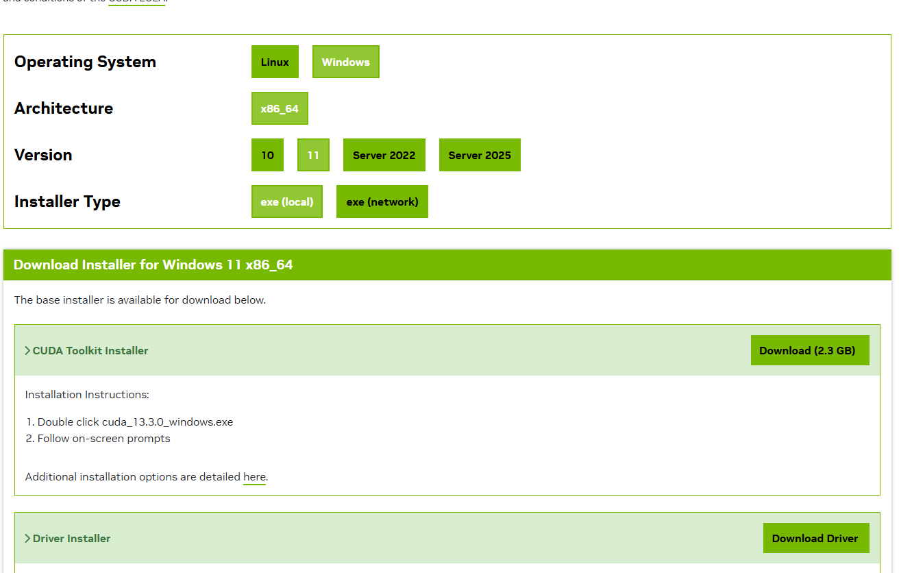

# CUDA安装小记
本文只是对[cuda官方文档](https://docs.nvidia.com/cuda/cuda-installation-guide-microsoft-windows/index.html)关于环境配置的总结

## 环境要求
- A CUDA-capable GPU
- A supported version of Microsoft Windows
- A supported version of Microsoft Visual Studio
- NVIDIA CUDA Toolkit (available at https://developer.nvidia.com/cuda-downloads)

### 我的配置
- Windows 11, version 25H2
- RTX 4060Ti

## 下载CUDA套件
[CUDA Toolkit 13.3 Downloads](https://developer.nvidia.com/cuda-downloads?target_os=Windows&target_arch=x86_64&target_version=11&target_type=exe_local)
下载后，按照安装器提示安装即可

## 验证用例
[cuda 用例](https://github.com/nvidia/cuda-samples)

推荐运行deviceQuery用例