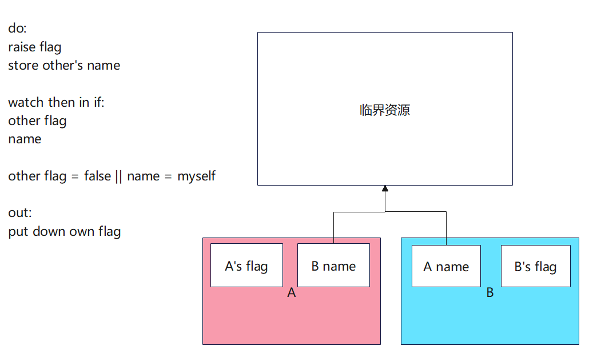

作业：

使用C语言编写peterson算法，并且编写model checker程序检查

使用原子交换实现自旋锁(Compare and swap, CAS)

# 互斥

### Amdahl's Law
T<sub>∞</sub> > T<sub>1</sub> / k

不能并行的代码，占总代码的1/k；T<sub>n</sub>为有n个处理器的时候，处理的时间

### Gustafson’s Law

T<sub>p</sub>  < (T<sub>∞</sub> + T<sub>1</sub> / p)

### 局部性原理
只能和相邻的事物进行交互->相邻的边占事物的很小的一部分

T<sub>∞</sub> << T<sub>1</sub>

## 实现互斥
### 1. 单处理器实现互斥
关中断   stop the world

NMI：不可屏蔽中断

### 2. Peterson算法（没啥用）
**实现假设**
- 任何时候可以执行一条load/store指令
- 读写本身是原子的



只能支持2个线程的互斥
### model checker
利用程序节省复杂的人工

## 多处理器系统的互斥
问题：load和store是分开的，你要么看，要么写

一个解法：同时load和store（软件不够，硬件来凑）

### 原子指令
原子指令：一小段时间的 stop the world

**自旋锁**
使用原子交换实现自旋锁(Compare and swap, CAS)
```C
extern atomic_xchg(int *a, int *b) // swap values of a and b atomatically
extern atomic_cmp_and_xchg(int *a, int *b, int value) // swap values of a and b atomatically when a equals to value


```

发生中断了怎么办？
所有需要锁的线程空转