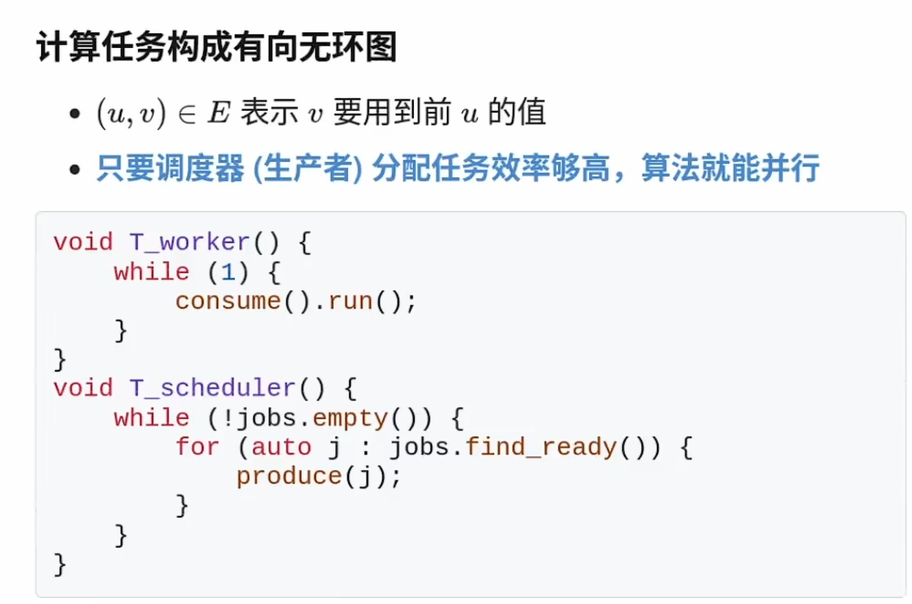

作业：
1. 使用自旋锁完成同步（AI辅助，做一个手动打点的卡农）
2. 使用生产者-消费者完成
3. 分析最长公共子序列的实现，尝试将它并行化

先到先等
**同步的条件**
## 生产者-消费者问题
1. 共享缓冲区（有限容量）
2. T<sub>prod</sub>: 如果缓冲区有空位，放入，否则等待, T<sub>cons</sub>：如果缓冲区有数据，取出，否则等待

### 打印括号
- 生产：打印左括号
- 消费：打印右括号
最终使得打印出的括号合法，并且嵌套深度不超过n

```C
int n = -1;
void produce() {
    int nums = n; 
    while(nums < n)
    printf("(");
}
void consume() {
    int nums = n; 
    while(nums > 0)
    printf(")");
}
```
- 使用一把锁（空转
- 使用条件变量（需要两个条件变量
## **条件变量**
- 把条件用一个变量替代
- 条件不满足时等待（同时释放锁），条件满足时唤醒（同时尝试获得锁**并再次检查条件**）

总是在唤醒后再次检查同步条件
总是唤醒所有潜在可能被唤醒的人

## 实现并发控制


### 为每一个节点设置一个条件变量
- v能执行的同步条件：u->v都已完成
- u完成后，signal每个u->v


状态机

## **信号量**
```C
void P(sem_t *sem) {
    atomic {
        wait_until(sem->count > 0) {
            sem->count--;
        }
    }
}

void V(sem_t *sem) {
    atomic {
        sem->count++;
    }
}